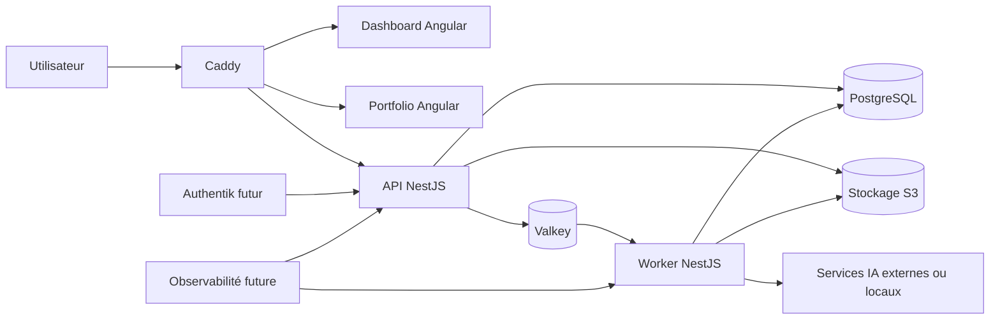

# Personal OS — Note produit initiale

> **Statut :** cadrage initial  
> **Version :** 0.1  
> **Date :** 3 août 2026  
> **Propriétaire du produit :** Maxime Dupré  
> **Nom de travail :** Personal OS  
> **Hébergement initial :** VPS OVH  
> **Hébergement cible :** homelab personnel  
> **Langue principale :** français  
> **Utilisateurs initiaux :** un utilisateur principal, avec possibilité d’ajouter ultérieurement un accès limité pour la compagne

> ⚠️ **Ce document est antérieur aux décisions d’architecture.**
> Il conserve sa valeur de cadrage initial, mais il est contredit sur plusieurs points par les ADR de [`docs/adr/`](docs/adr/), qui font autorité, et par le glossaire [`CONTEXT.md`](CONTEXT.md), qui fait autorité sur le vocabulaire.
> Les sections concernées portent un renvoi explicite. En cas de désaccord entre ce document et un ADR, **l’ADR l’emporte**.

---

## 1. Résumé du produit

Personal OS est une application web privée destinée à centraliser, organiser et automatiser les principaux aspects de la vie personnelle et professionnelle de son utilisateur.

L’application doit servir de tableau de bord unique pour :

- suivre les événements et échéances importantes ;
- organiser les entraînements sportifs ;
- préparer les repas de la semaine avec assistance d’une IA ;
- générer et utiliser une liste de courses consolidée ;
- gérer les finances personnelles ;
- classer les documents professionnels et administratifs ;
- suivre un bien immobilier mis en location ;
- gérer les projets, la documentation et les connaissances ;
- administrer un portfolio professionnel public ;
- préparer progressivement l’intégration de nouveaux modules.

Le produit doit rester durable, auto-hébergeable, exportable et maîtrisé par son utilisateur. Il ne doit pas dépendre fortement d’un fournisseur cloud propriétaire.

---

## 2. Vision

Créer un véritable **système d’exploitation personnel**, accessible depuis un ordinateur ou un téléphone, qui remplace progressivement les feuilles de calcul dispersées, les dossiers non structurés, les notes isolées et les tâches administratives répétitives.

Le produit doit permettre de répondre rapidement à des questions comme :

- Quelles sont mes échéances importantes cette semaine ?
- Quel entraînement dois-je effectuer aujourd’hui ?
- Quels repas sont prévus cette semaine ?
- Que dois-je acheter et dans quelles quantités ?
- Combien ai-je dépensé ce mois-ci ?
- Où se trouve ma fiche de paie de mars 2026 ?
- Quels documents concernent mon appartement loué ?
- Quel loyer a été reçu et quelles charges restent à payer ?
- Quels projets doivent apparaître dans mon portfolio ?
- Quelle documentation ai-je déjà produite sur une technologie ou un projet ?
- Quelles actions importantes nécessitent mon attention aujourd’hui ?

À long terme, Personal OS doit devenir le point d’entrée principal de l’environnement numérique personnel de l’utilisateur.

---

## 3. Principes directeurs

### 3.1 Propriété des données

Les données appartiennent à l’utilisateur.

Le système doit proposer autant que possible :

- des formats standards ;
- des exports lisibles ;
- des sauvegardes automatisées ;
- une architecture indépendante de l’hébergeur ;
- une migration simple du VPS vers le homelab ;
- aucune dépendance obligatoire à un SaaS fermé.

### 3.2 Sécurité par défaut

Le produit contiendra des données sensibles :

- fiches de paie ;
- documents administratifs ;
- finances personnelles ;
- documents immobiliers ;
- contrats ;
- informations professionnelles.

Les choix techniques doivent donc privilégier :

- une authentification robuste ;
- des permissions strictes ;
- des cookies sécurisés ;
- le chiffrement des communications ;
- la limitation de l’exposition publique ;
- une journalisation des actions sensibles ;
- des sauvegardes chiffrées hors site.

### 3.3 Monolithe modulaire

Le backend doit rester un monolithe modulaire aussi longtemps que possible.

Chaque domaine métier doit être isolé dans un module clair, sans être transformé prématurément en microservice.

Les traitements longs pourront être déportés dans un worker séparé, tout en restant dans le même monorepo et en partageant la même base PostgreSQL.

### 3.4 Progressivité

Le produit doit être construit par étapes.

Les fonctionnalités utiles et simples doivent être livrées avant :

- les intégrations complexes ;
- l’OCR avancé ;
- la comparaison automatisée des prix en magasin ;
- les connexions bancaires ;
- les systèmes distribués ;
- Kubernetes ;
- la haute disponibilité.

### 3.5 Validation humaine des actions IA

L’IA peut proposer, classer, résumer et préremplir.

Elle ne doit pas prendre seule une décision importante concernant :

- les finances ;
- les documents ;
- la publication du portfolio ;
- la suppression de données ;
- les repas définitivement planifiés ;
- les transactions ;
- les échéances administratives.

Toute proposition importante doit pouvoir être vérifiée et validée manuellement.

---

## 4. Objectifs

### 4.1 Objectifs principaux

1. Centraliser les informations personnelles et professionnelles.
2. Réduire le temps passé à rechercher des documents.
3. Simplifier l’organisation hebdomadaire.
4. Automatiser les tâches répétitives avec validation humaine.
5. Fournir un tableau de bord clair et utilisable sur mobile.
6. Créer une base solide pour le futur homelab.
7. Gérer le portfolio public depuis le même environnement privé.
8. Conserver un contrôle complet sur les données et l’hébergement.

### 4.2 Critères de réussite initiaux

La première version utile est considérée comme réussie lorsque l’utilisateur peut :

- se connecter de manière sécurisée ;
- consulter un tableau de bord quotidien ;
- créer et visualiser des événements ;
- enregistrer son planning sportif ;
- générer un planning de repas avec l’IA ;
- accepter ou modifier les repas proposés ;
- produire une liste de courses consolidée ;
- importer et retrouver un document ;
- suivre des transactions et un budget simple ;
- publier un projet sélectionné dans le portfolio ;
- sauvegarder automatiquement la base et les documents.

---

## 5. Hors périmètre initial

Les éléments suivants ne font pas partie de la première version :

- agrégation bancaire automatique ;
- initiation de paiement ;
- comparaison exhaustive en temps réel des prix de toutes les enseignes ;
- commande automatique de courses ;
- OCR et extraction parfaits pour tous les documents ;
- application mobile native ;
- fonctionnement intégral hors ligne ;
- gestion multi-utilisateur complète ;
- microservices ;
- Kubernetes ;
- haute disponibilité ;
- moteur de recherche externe de type Elasticsearch ;
- automatisation complète de la gestion locative ;
- publication automatique d’un contenu produit par l’IA sans validation ;
- remplacement complet d’Obsidian.

---

## 6. Utilisateurs et accès

### 6.1 Utilisateur principal

L’utilisateur principal dispose de tous les droits :

- accès à tous les modules ;
- administration ;
- gestion des documents ;
- gestion des finances ;
- gestion du portfolio ;
- paramétrage de l’IA ;
- export et sauvegarde ;
- gestion des intégrations.

### 6.2 Utilisateur secondaire futur

> **Périmé — voir [ADR 0014](docs/adr/0014-deux-utilisateurs-cloisonnes-par-espace.md).** Personal OS est une application à deux utilisateurs de plein droit dès la V1, chacun avec ses données privées. Ce n’est pas un compte principal assorti d’un accès limité. Le cloisonnement repose sur l’**Espace**.

Un accès limité pourra être ajouté pour la compagne, notamment pour :

- voir ou modifier les repas ;
- utiliser la liste de courses ;
- consulter certains événements partagés ;
- ajouter des préférences alimentaires ;
- visualiser certaines tâches domestiques.

Cet accès ne devra pas ouvrir automatiquement :

- les fiches de paie ;
- les finances personnelles détaillées ;
- les documents professionnels ;
- les documents immobiliers confidentiels ;
- les paramètres d’administration.

### 6.3 Portfolio public

Le portfolio est accessible sans authentification.

Seules les données explicitement marquées comme publiques peuvent y apparaître.

Aucune donnée privée ne doit être rendue publique par défaut.

---

## 7. Périmètre fonctionnel

## 7.1 Tableau de bord

Le tableau de bord est la page d’accueil de l’application privée.

> **Précisé — voir [ADR 0017](docs/adr/0017-rien-de-ce-qui-requiert-l-attention-n-est-stocke.md) et [ADR 0018](docs/adr/0018-barre-de-commande-prepare-mais-n-execute-jamais.md).** Les « tâches à valider » et les échéances affichées ici sont des **À faire** calculés depuis l’état des modules ; rien n’est stocké et rien ne se coche. La page d’accueil porte en outre une barre de commande en langage naturel qui prépare les actions sans jamais les exécuter.

Il doit afficher les informations les plus importantes du moment :

- date et heure ;
- événements du jour ;
- entraînement prévu ;
- repas du jour ;
- articles restants dans la liste de courses ;
- échéances proches ;
- documents nécessitant une action ;
- résumé budgétaire ;
- état des tâches importantes ;
- raccourcis vers les modules fréquemment utilisés.

### Widgets envisagés

- calendrier du jour ;
- semaine sportive ;
- repas de la journée ;
- solde budgétaire mensuel ;
- dépenses récentes ;
- échéances administratives ;
- documents récents ;
- loyer reçu ou attendu ;
- projets en cours ;
- tâches à valider ;
- alertes de sauvegarde ou d’infrastructure.

Le dashboard devra devenir personnalisable ultérieurement :

- ordre des widgets ;
- taille ;
- visibilité ;
- configuration par utilisateur.

---

## 7.2 Calendrier et dates importantes

> **Précisé — voir [ADR 0011](docs/adr/0011-objets-dates-possedes-par-les-modules.md) et [ADR 0017](docs/adr/0017-rien-de-ce-qui-requiert-l-attention-n-est-stocke.md).** Le module Calendrier ne possède que les **Événements** : ni les séances de sport, ni les repas planifiés n’y sont stockés, ils sont seulement affichés par l’**Agenda**. Une « échéance » est un Événement portant une catégorie dédiée. Un « rappel » est un délai porté par l’Événement, pas un objet. La récurrence est représentée par une règle plus des exceptions, les occurrences étant calculées à la lecture.

### Fonctionnalités

- création d’événements ;
- événements personnels, professionnels, sportifs et administratifs ;
- événements ponctuels ou récurrents ;
- rappels ;
- catégories ;
- couleurs ;
- pièces jointes ;
- notes ;
- lien vers un document ou un projet ;
- vues jour, semaine, mois et agenda ;
- import et export au format iCalendar ;
- synchronisation future avec Google Calendar ou CalDAV.

### Types d’événements initiaux

- sport ;
- santé ;
- personnel ;
- professionnel ;
- administratif ;
- immobilier ;
- fiscalité ;
- anniversaire ;
- échéance documentaire ;
- rappel de paiement.

---

## 7.3 Sport

Le module sport doit permettre de gérer un plan d’entraînement structuré.

> **Périmé — voir [ADR 0022](docs/adr/0022-une-seance-porte-le-prevu-et-le-realise-il-n-y-a-pas-de-plan.md).** Il n’existe pas d’entité plan d’entraînement. Une **Séance** porte à la fois le prévu et le réalisé, et un **Objectif** (une course, une date) remplace la notion de plan.

### Fonctionnalités initiales

- calendrier sportif ;
- création de séances ;
- types de séances ;
- durée ;
- distance ;
- allure cible ;
- zones cardiaques ;
- intervalles ;
- notes avant et après séance ;
- niveau de difficulté perçu ;
- statut prévu, réalisé, modifié ou annulé ;
- historique ;
- statistiques simples.

### Types de séances

- endurance fondamentale ;
- récupération ;
- sortie longue ;
- fractionné court ;
- fractionné long ;
- tempo ;
- course ;
- renforcement musculaire ;
- mobilité ;
- repos.

### Évolutions possibles

- import Garmin ;
- export de séances structurées ;
- import GPX ou FIT ;
- suivi des records ;
- adaptation automatique du plan ;
- recommandations selon la charge et la récupération ;
- liens avec les repas et le sommeil.

---

## 7.4 Repas, recettes et courses

Le module repas est l’un des premiers cas d’usage majeurs de l’IA.

### 7.4.1 Recettes

Une recette contient notamment :

- nom ;
- description ;
- portions ;
- temps de préparation ;
- temps de cuisson ;
- ingrédients ;
- quantités ;
- unités ;
- étapes ;
- catégories ;
- tags ;
- difficulté ;
- coût estimé ;
- informations nutritionnelles facultatives ;
- source ;
- note personnelle ;
- appréciation ;
- date de dernière utilisation ;
- compatibilité avec les préférences alimentaires.

### 7.4.2 Préférences alimentaires

Le système doit gérer :

- allergies ;
- aliments exclus ;
- aliments peu appréciés ;
- préférences du foyer ;
- nombre de personnes ;
- budget ;
- temps disponible ;
- matériel disponible ;
- objectifs sportifs ;
- fréquence souhaitée de réutilisation des restes.

Préférences déjà identifiées :

- allergie aux noix de cajou ;
- éviter les recettes reposant sur le curry ;
- éviter le lait de coco ;
- éviter les lentilles ;
- privilégier une base tomate lorsque la crème fraîche n’est pas appréciée.

### 7.4.3 Planning hebdomadaire

> **Précisé — voir [ADR 0013](docs/adr/0013-stock-domestique-declaratif.md) et le glossaire.** La génération procède par **tours** : l’IA propose, l’utilisateur statue sur *chacun* des repas, puis relance ; seuls les repas refusés sont régénérés. Un refus n’exclut que pour la semaine en cours — pour qu’il devienne durable, il faut une **Préférence alimentaire** explicite, que le système peut proposer mais n’écrit jamais seul. Les préférences appliquées sont celles des **Participants** du repas concerné, pas du foyer entier.

Workflow cible :

1. L’utilisateur choisit la semaine.
2. Il définit éventuellement des contraintes.
3. L’IA propose des repas.
4. Chaque repas obtient le statut `PROPOSED`.
5. L’utilisateur accepte, modifie, remplace ou refuse.
6. Les repas validés obtiennent le statut `APPROVED`.
7. La liste de courses est recalculée.
8. Les produits déjà disponibles peuvent être retirés.
9. La liste est utilisée pendant les courses.
10. Les retours de l’utilisateur enrichissent les préférences.

### 7.4.4 Liste de courses

> **Précisé — voir [ADR 0012](docs/adr/0012-liste-de-courses-figee-a-l-edition.md) et [ADR 0013](docs/adr/0013-stock-domestique-declaratif.md).** La liste n’est **pas** recalculée : produire une liste la fige. Un changement de planning postérieur ne la modifie jamais ; le système signale l’écart et propose une liste complémentaire. La consolidation passe par l’**Unité canonique** de chaque **Ingrédient**. Le stock domestique est quantitatif et déclaratif.

La liste doit :

- consolider les ingrédients identiques ;
- convertir ou normaliser les unités ;
- regrouper les articles par rayon ;
- gérer les quantités ;
- permettre de cocher les produits ;
- prendre en compte le stock domestique ;
- permettre l’ajout manuel ;
- distinguer les produits obligatoires et optionnels ;
- indiquer les recettes concernées ;
- conserver l’historique.

### 7.4.5 Alternatives de produits

> **Précisé — voir [`CONTEXT.md`](CONTEXT.md).** Le **Produit** existe comme entité distincte de l’**Ingrédient** dès la V1 : on cuisine des ingrédients, on achète des produits. Un **Article de courses** référence toujours un ingrédient, et éventuellement un produit préféré. La comparaison par enseigne reste différée.

La première version proposera des alternatives génériques :

- frais ou surgelé ;
- marque nationale ou marque distributeur ;
- viande, poisson ou alternative végétale ;
- produit exact ou substitut proche.

La comparaison par enseigne sera une évolution séparée.

Enseignes envisagées :

- E.Leclerc ;
- Carrefour ;
- Auchan ;
- Intermarché ;
- Lidl ;
- Aldi ;
- Super U ;
- magasins locaux selon les données disponibles.

Cette fonctionnalité dépendra de la disponibilité légale et technique de données fiables sur :

- les catalogues ;
- les prix ;
- les formats ;
- la localisation ;
- les stocks ;
- les promotions.

Aucune intégration ne doit reposer durablement sur du scraping fragile sans validation juridique et technique.

---

## 7.5 Documents

Le module documents doit centraliser les fichiers sensibles et administratifs.

### Catégories initiales

#### Professionnel

- contrats de travail ;
- fiches de paie ;
- avenants ;
- entretiens annuels ;
- attestations ;
- certifications ;
- CV ;
- candidatures ;
- documents d’entreprise.

#### Personnel

- identité ;
- assurances ;
- santé ;
- fiscalité ;
- factures ;
- abonnements ;
- garanties ;
- véhicules.

#### Immobilier

- acte d’achat ;
- crédit ;
- assurance emprunteur ;
- copropriété ;
- travaux ;
- agence locative ;
- bail ;
- état des lieux ;
- loyers ;
- charges ;
- diagnostics ;
- fiscalité LMNP ;
- déclarations ;
- factures.

### Métadonnées

Chaque document doit pouvoir contenir :

- identifiant ;
- titre ;
- nom d’origine ;
- catégorie ;
- sous-catégorie ;
- date du document ;
- date d’expiration ;
- émetteur ;
- destinataire ;
- tags ;
- statut ;
- niveau de confidentialité ;
- lien vers un employeur ;
- lien vers un logement ;
- lien vers un projet ;
- clé de stockage S3 ;
- type MIME ;
- taille ;
- checksum SHA-256 ;
- date d’import ;
- statut d’analyse ;
- version ;
- commentaire.

### Workflow d’import

1. L’utilisateur sélectionne un fichier.
2. Angular demande une URL d’envoi pré-signée.
3. NestJS contrôle les droits et crée une session d’import.
4. Le fichier est envoyé vers le stockage S3.
5. Les métadonnées sont enregistrées dans PostgreSQL.
6. Un job est envoyé au worker.
7. Le worker vérifie le fichier.
8. Une analyse facultative est effectuée.
9. L’utilisateur valide les métadonnées proposées.
10. Le document devient consultable.

### Évolutions

- OCR ;
- extraction de dates ;
- détection du type de document ;
- classement assisté par IA ;
- recherche plein texte ;
- génération de rappels ;
- détection des doublons ;
- résumé ;
- extraction des montants ;
- archivage automatique ;
- versionnage.

---

## 7.6 Finances personnelles

### Fonctionnalités initiales

- comptes manuels ;
- transactions ;
- catégories ;
- sous-catégories ;
- opérations récurrentes ;
- budgets mensuels ;
- import CSV ;
- catégorisation assistée ;
- règles automatiques ;
- graphiques ;
- prévision de trésorerie ;
- suivi de l’épargne ;
- distinction entre finances personnelles et immobilier ;
- exports CSV.

### Entités principales

- Account ;
- Transaction ;
- TransactionCategory ;
- Budget ;
- BudgetPeriod ;
- RecurringTransaction ;
- ImportBatch ;
- CategorizationRule.

### Principes

- aucune connexion bancaire obligatoire en V1 ;
- aucun stockage de secret bancaire ;
- aucune initiation de paiement ;
- les imports doivent être réversibles ;
- chaque import doit éviter les doublons ;
- les catégorisations automatiques doivent rester modifiables.

---

## 7.7 Immobilier locatif

Le module immobilier doit permettre de suivre le logement loué.

### Informations du bien

- adresse ou libellé ;
- type de bien ;
- prix d’achat ;
- valeur estimée ;
- crédit ;
- mensualité ;
- taux ;
- durée ;
- assurance ;
- taxe foncière ;
- charges ;
- agence ;
- loyer ;
- statut LMNP ;
- dates importantes.

### Gestion locative

- locataires ;
- bail ;
- dépôt de garantie ;
- loyers attendus ;
- loyers reçus ;
- frais d’agence ;
- dépenses ;
- travaux ;
- charges ;
- documents ;
- échéances ;
- incidents ;
- indexation du loyer ;
- régularisation ;
- fiscalité.

### Indicateurs

- cash-flow mensuel ;
- rendement brut ;
- rendement net estimé ;
- reste à charge ;
- loyers en retard ;
- dépenses annuelles ;
- total des charges ;
- documents manquants ;
- échéances fiscales.

### Limites

Le produit ne remplace pas :

- un expert-comptable ;
- un logiciel fiscal homologué ;
- un professionnel du droit ;
- les déclarations officielles.

Il sert principalement à centraliser et préparer les informations.

---

## 7.8 Projets et documentation

Le module projets relie les aspects personnels et professionnels.

### Projet

Un projet peut contenir :

- nom ;
- description ;
- statut ;
- dates ;
- priorité ;
- objectifs ;
- tâches ;
- technologies ;
- liens ;
- dépôts GitHub ;
- documents ;
- décisions d’architecture ;
- notes ;
- dépenses ;
- captures d’écran ;
- éléments publics du portfolio.

### Statuts possibles

- idée ;
- étude ;
- planifié ;
- en cours ;
- en pause ;
- terminé ;
- abandonné ;
- archivé.

### Documentation

La documentation peut rester partagée entre :

- le dashboard ;
- un dépôt Git ;
- un Vault Obsidian ;
- des fichiers Markdown.

Personal OS ne doit pas chercher à recréer entièrement Obsidian.

Le système pourra proposer :

- un index des notes ;
- des liens vers les fichiers Markdown ;
- des métadonnées ;
- une recherche ;
- une ouverture via URI Obsidian ;
- une publication contrôlée vers le portfolio.

---

## 7.9 Portfolio public

Le portfolio est une application publique distincte du dashboard privé, bien que les deux partagent le même monorepo et certaines bibliothèques.

> **Périmé — voir [ADR 0019](docs/adr/0019-le-portfolio-est-redige-pas-genere.md) et [ADR 0014](docs/adr/0014-deux-utilisateurs-cloisonnes-par-espace.md).** L’échelle `PRIVATE / INTERNAL / PUBLIC_DRAFT / PUBLIC` est abandonnée : l’**Espace** dit qui, dans le foyer, voit une donnée ; l’**État de publication** dit seulement si elle est sortie sur Internet. Il n’y a **qu’un seul portfolio**, en français et en anglais — les profils sont abandonnés. Les pages présentation, expériences et compétences sont des contenus **rédigés**, sans entités structurées. Le **CV** est un PDF rédigé hors de l’application et téléversé : il n’est pas généré. Le portfolio lit les données publiées via un endpoint public dédié servant des DTO publics.

### Pages initiales

- accueil ;
- présentation ;
- expériences ;
- compétences ;
- projets ;
- études de cas ;
- CV ;
- contact.

### Gestion depuis le dashboard

L’utilisateur doit pouvoir :

- créer un projet ;
- ajouter une description privée ;
- ajouter une description publique ;
- choisir les technologies ;
- ajouter des captures ;
- définir l’ordre d’affichage ;
- publier ou dépublier ;
- mettre en avant ;
- gérer une version française ;
- gérer une version anglaise ;
- choisir un profil de portfolio ;
- générer un CV à partir des données.

### Séparation public/privé

Chaque contenu doit avoir une visibilité explicite :

- `PRIVATE` ;
- `INTERNAL` ;
- `PUBLIC_DRAFT` ;
- `PUBLIC`.

Un contenu ne doit jamais devenir public à cause d’une valeur implicite ou manquante.

### Profils futurs

- développeur Java full-stack ;
- développeur produit ;
- freelance ;
- profil adapté à une candidature.

---

## 8. Expérience utilisateur

## 8.1 Principes UI

- interface lisible ;
- responsive ;
- utilisable sur mobile ;
- navigation cohérente ;
- densité adaptée à un dashboard ;
- saisie rapide ;
- raccourcis clavier sur desktop ;
- composants accessibles ;
- confirmation des actions destructrices ;
- états de chargement explicites ;
- erreurs compréhensibles ;
- actions importantes réversibles lorsque possible.

## 8.2 Navigation proposée

```text
Accueil

Organisation
├── Calendrier
├── Sport
├── Repas
└── Courses

Gestion
├── Finances
├── Documents
└── Immobilier

Professionnel
├── Projets
├── Documentation
└── Portfolio

Système
├── Notifications
├── Intégrations
├── Sauvegardes
└── Paramètres
```

## 8.3 Design system

Base initiale :

- Angular Material ;
- Angular CDK ;
- composants internes partagés ;
- variables CSS ;
- thème clair et sombre ;
- responsive mobile-first pour les usages quotidiens ;
- mise en page plus dense pour les écrans de gestion.

Un design system interne pourra être extrait dans une bibliothèque Nx.

---

## 9. Architecture technique

## 9.1 Vue générale



## 9.2 Monorepo

Outils :

- Nx ;
- pnpm workspaces.

Structure cible :

```text
personal-os/
├── apps/
│   ├── dashboard/
│   ├── portfolio/
│   ├── api/
│   └── worker/
│
├── libs/
│   ├── angular/
│   │   ├── ui/
│   │   ├── auth/
│   │   ├── layout/
│   │   └── api-client/
│   │
│   ├── nest/
│   │   ├── database/
│   │   ├── storage/
│   │   ├── auth/
│   │   ├── queue/
│   │   └── observability/
│   │
│   ├── domains/
│   │   ├── calendar/
│   │   ├── sport/
│   │   ├── meals/
│   │   ├── shopping/
│   │   ├── documents/
│   │   ├── finance/
│   │   ├── real-estate/
│   │   ├── projects/
│   │   └── portfolio/
│   │
│   └── shared/
│       ├── contracts/
│       ├── validation/
│       ├── utilities/
│       └── testing/
│
├── infra/
│   ├── docker/
│   ├── caddy/
│   ├── monitoring/
│   ├── backup/
│   └── scripts/
│
├── docs/
│   ├── product/
│   ├── architecture/
│   ├── adr/
│   └── operations/
│
├── compose.yml
├── compose.dev.yml
├── compose.prod.yml
├── nx.json
├── pnpm-workspace.yaml
└── README.md
```

## 9.3 Frontend

### Technologies

- Angular ;
- Angular Material ;
- Angular CDK ;
- Signals ;
- RxJS ;
- Angular HttpClient ;
- Angular Service Worker ultérieurement ;
- Vitest ;
- Playwright.

### Architecture frontend

Chaque domaine fonctionnel doit comporter autant que possible :

```text
feature/
├── pages/
├── components/
├── data-access/
├── models/
├── stores/
├── utilities/
└── routes.ts
```

### Gestion d’état

Commencer avec :

- Signals ;
- `computed` ;
- services injectables ;
- RxJS pour les flux asynchrones ;
- client HTTP généré.

Ne pas introduire NgRx sans besoin démontré.

### Portfolio

Le portfolio doit utiliser le prerendering ou le rendu serveur selon les besoins.

Le dashboard privé peut rester principalement rendu côté client.

---

## 9.4 Backend

### Technologies

- NestJS ;
- API REST ;
- OpenAPI ;
- Prisma ;
- PostgreSQL ;
- BullMQ ;
- Valkey ;
- SDK S3 ;
- Zod ou validation NestJS ;
- logs structurés.

### Modules NestJS initiaux

```text
AppModule
├── AuthModule
├── UsersModule
├── CalendarModule
├── SportModule
├── MealsModule
├── ShoppingModule
├── DocumentsModule
├── FinanceModule
├── RealEstateModule
├── ProjectsModule
├── PortfolioModule
├── StorageModule
├── JobsModule
├── NotificationsModule
├── AiModule
├── HealthModule
└── AuditModule
```

### Architecture d’un module

> **Reporté — voir [ADR 0016](docs/adr/0016-modules-plats-et-filtrage-espace-centralise.md).** Un module démarre **plat** (contrôleur, service, accès aux données, DTO) et n’est approfondi que là où une vraie règle apparaît. En contrepartie, le filtrage par **Espace** n’est pas laissé aux services : il est appliqué au niveau de l’accès aux données, en un seul endroit.

```text
documents/
├── application/
│   ├── commands/
│   ├── queries/
│   └── services/
├── domain/
│   ├── entities/
│   ├── value-objects/
│   └── policies/
├── infrastructure/
│   ├── prisma/
│   ├── storage/
│   └── queues/
├── presentation/
│   ├── controllers/
│   └── dto/
└── documents.module.ts
```

Cette structure est une cible. Elle peut être simplifiée au début afin d’éviter une complexité artificielle.

### Contrat API

- REST ;
- JSON ;
- OpenAPI généré ;
- client Angular généré ;
- pagination ;
- filtres explicites ;
- erreurs normalisées ;
- versionnement lorsque nécessaire.

Les modèles Prisma ne doivent pas être exposés directement au frontend.

---

## 9.5 Worker

Une application NestJS distincte doit traiter :

- génération de menus ;
- traitement de documents ;
- OCR ;
- miniatures ;
- indexation ;
- imports ;
- notifications ;
- génération de CV ;
- synchronisations ;
- tâches planifiées.

Le worker partage :

- les bibliothèques de domaine ;
- Prisma ;
- les contrats de jobs ;
- la configuration ;
- les outils d’observabilité.

### États de job

- queued ;
- active ;
- completed ;
- failed ;
- retrying ;
- cancelled.

Les traitements doivent être :

- idempotents lorsque possible ;
- rejouables ;
- traçables ;
- limités en nombre de tentatives ;
- associés à une erreur lisible.

---

## 9.6 Base de données

### Technologie

PostgreSQL.

### ORM

Prisma en version stable.

### Principes

- migrations versionnées ;
- migrations exécutées avant le déploiement applicatif ;
- aucune modification manuelle non tracée en production ;
- clés UUID ;
- timestamps ;
- suppression logique pour certaines données ;
- transactions pour les opérations critiques ;
- contraintes en base ;
- index explicites ;
- audit des modifications sensibles.

### Schémas ou séparation logique

Un seul PostgreSQL est suffisant.

La séparation se fait principalement par modules et conventions.

Des schémas PostgreSQL distincts ne seront ajoutés que s’ils apportent une valeur claire.

---

## 9.7 Stockage objet S3

### Hébergement initial

Le stockage peut être :

- un service S3 externe compatible ;
- un stockage objet OVHcloud ;
- une instance compatible S3 déployée séparément ;
- une solution temporaire locale uniquement pour le développement.

Le choix exact doit pouvoir être changé sans modifier la logique métier.

### Hébergement cible

Dans le futur homelab, une solution compatible S3 auto-hébergée sera utilisée.

Garage est la solution cible envisagée.

### Abstraction

NestJS doit exposer une interface générique :

```ts
interface ObjectStorage {
  putObject(input: PutObjectInput): Promise<StoredObject>;
  getObject(key: string): Promise<NodeJS.ReadableStream>;
  createSignedUploadUrl(input: SignedUploadInput): Promise<string>;
  createSignedDownloadUrl(key: string): Promise<string>;
  deleteObject(key: string): Promise<void>;
  objectExists(key: string): Promise<boolean>;
}
```

### Buckets ou préfixes

```text
documents-private/
portfolio-public/
portfolio-drafts/
exports/
imports/
temporary/
backups/
```

Les fichiers privés et publics doivent être strictement séparés.

---

## 10. Intelligence artificielle

## 10.1 Cas d’usage initiaux

- génération de menus ;
- proposition de recettes ;
- regroupement et normalisation des ingrédients ;
- catégorisation de transactions ;
- classification de documents ;
- extraction de métadonnées ;
- rédaction de descriptions de portfolio ;
- résumé de notes ;
- aide à la recherche documentaire.

## 10.2 Sorties structurées

Les appels IA doivent produire des résultats validés par un schéma.

Exemple de planning :

```json
{
  "weekStart": "2026-08-03",
  "meals": [
    {
      "date": "2026-08-03",
      "mealType": "DINNER",
      "recipeId": "optional-existing-id",
      "title": "Saumon au four et riz",
      "servings": 2,
      "status": "PROPOSED",
      "ingredients": []
    }
  ]
}
```

## 10.3 Traçabilité

Chaque génération importante doit conserver :

- le fournisseur ;
- le modèle ;
- la date ;
- le prompt ou une référence vers sa version ;
- les paramètres ;
- la réponse brute si autorisée ;
- la réponse structurée ;
- le statut de validation ;
- le coût estimé ;
- l’utilisateur à l’origine de la demande.

## 10.4 Confidentialité

Les documents sensibles ne doivent pas être envoyés à un fournisseur externe sans :

- action explicite ;
- information claire ;
- politique de confidentialité acceptable ;
- possibilité d’utiliser un traitement local ultérieurement.

Le système doit permettre de remplacer un fournisseur d’IA par :

- un autre fournisseur ;
- un modèle local dans le homelab ;
- un service compatible avec une interface commune.

---

## 11. Authentification et autorisation

## 11.1 Hébergement initial sur VPS

> **Tranché — voir [ADR 0015](docs/adr/0015-authentik-des-le-vps-avec-session-serveur.md).** C’est l’option B : Authentik est déployé dès le VPS. L’API reste un client OIDC ordinaire et émet sa propre session serveur. Authentik répond à « qui es-tu », l’application répond à « que peux-tu voir ».

Pour la première version, deux options sont acceptables :

### Option A — Authentification directement dans NestJS

Appropriée pour démarrer rapidement avec :

- un seul utilisateur ;
- session serveur ;
- cookie HttpOnly ;
- mot de passe fort ;
- TOTP ou passkey ;
- récupération de compte sécurisée.

### Option B — Authentik dès le VPS

Appropriée si l’objectif est d’utiliser rapidement une identité centralisée pour plusieurs services.

### Décision initiale recommandée

Commencer avec une authentification NestJS robuste si Authentik ralentit trop la V1.

Préparer toutefois l’application à accepter ultérieurement un fournisseur OIDC.

## 11.2 Hébergement cible homelab

Authentik devient le fournisseur d’identité central.

Il pourra être utilisé par :

- Personal OS ;
- Grafana ;
- les outils d’administration ;
- d’autres applications personnelles.

## 11.3 Sessions

Préférences :

- session serveur ;
- cookie `HttpOnly` ;
- cookie `Secure` ;
- `SameSite=Lax` ou plus strict selon les flux ;
- rotation de session ;
- expiration ;
- révocation ;
- protection CSRF ;
- aucune conservation permanente de token dans `localStorage`.

## 11.4 Autorisations

Le système doit évoluer vers des permissions explicites :

- rôle ;
- module ;
- ressource ;
- propriétaire ;
- niveau de confidentialité.

Les contrôles doivent être réalisés dans le backend, jamais uniquement dans Angular.

---

## 12. Sécurité

### Exigences minimales

- HTTPS obligatoire ;
- reverse proxy ;
- headers de sécurité ;
- limitation de débit ;
- validation de toutes les entrées ;
- protection CSRF ;
- contrôle des fichiers importés ;
- journal d’audit ;
- secrets hors du dépôt Git ;
- rotation des secrets ;
- dépendances mises à jour ;
- scans d’images Docker ;
- sauvegardes chiffrées ;
- restauration testée ;
- base et stockage non exposés publiquement.

### Import de fichiers

Contrôles prévus :

- taille maximale ;
- extension autorisée ;
- type MIME déclaré ;
- détection du type réel ;
- checksum ;
- nom de fichier normalisé ;
- stockage sous une clé interne aléatoire ;
- analyse antivirus ultérieure ;
- quarantaine avant validation si nécessaire.

### Données publiques

Le portfolio ne doit lire que :

- des vues dédiées ;
- des DTO publics ;
- des données explicitement publiées.

Il ne doit jamais accéder directement à l’ensemble du modèle privé.

---

## 13. Hébergement initial — VPS OVH

## 13.1 Objectif

La première version de Personal OS sera hébergée sur un VPS OVH avant sa migration vers le futur homelab.

L’architecture doit donc fonctionner avec une seule machine tout en restant facilement migrable.

## 13.2 Services Docker Compose

```text
VPS OVH
├── Caddy
├── Dashboard Angular
├── Portfolio Angular
├── API NestJS
├── Worker NestJS
├── PostgreSQL
├── Valkey
├── service S3 ou accès S3 externe
└── tâches de sauvegarde
```

### Exemple conceptuel

```yaml
services:
  caddy:
    image: caddy
    restart: unless-stopped

  dashboard:
    image: ghcr.io/<owner>/personal-os-dashboard:<version>
    restart: unless-stopped

  portfolio:
    image: ghcr.io/<owner>/personal-os-portfolio:<version>
    restart: unless-stopped

  api:
    image: ghcr.io/<owner>/personal-os-api:<version>
    restart: unless-stopped

  worker:
    image: ghcr.io/<owner>/personal-os-worker:<version>
    restart: unless-stopped

  postgres:
    image: postgres:<version>
    restart: unless-stopped

  valkey:
    image: valkey/valkey:<version>
    restart: unless-stopped
```

Le fichier de production final devra inclure :

- réseaux privés ;
- volumes persistants ;
- health checks ;
- limites de ressources ;
- politiques de redémarrage ;
- secrets ;
- logs ;
- sauvegardes ;
- versions figées.

## 13.3 Exposition réseau

Exposé publiquement :

- port 80 redirigé vers 443 ;
- port 443 ;
- éventuellement SSH avec restrictions.

Non exposé publiquement :

- PostgreSQL ;
- Valkey ;
- worker ;
- stockage interne ;
- endpoints d’administration ;
- métriques.

## 13.4 Domaines envisagés

```text
www.<domaine>
portfolio.<domaine>
app.<domaine>
```

L’API peut être servie sous :

```text
app.<domaine>/api
```

Cette approche est préférée à un sous-domaine API séparé pour simplifier :

- cookies ;
- CORS ;
- CSRF ;
- routage ;
- sécurité.

## 13.5 Déploiement

Workflow initial :

```text
GitHub
  ↓
GitHub Actions
  ├── lint
  ├── tests
  ├── build
  ├── build images
  └── push GHCR
        ↓
VPS OVH
  ├── docker compose pull
  ├── migrations
  └── docker compose up -d
```

Le déploiement peut d’abord être déclenché manuellement via SSH.

Une automatisation plus avancée pourra venir ensuite.

> **Périmé — voir [ADR 0023](docs/adr/0023-deploiement-automatique-tire-par-le-vps.md).** Le déploiement est automatique dès qu’un commit atteint la branche principale, qui devient une branche de livraison. L’exécution est **tirée** : GitHub construit et pousse les images, un agent sur le VPS détecte la nouvelle version et exécute la séquence localement. GitHub n’a aucun accès entrant au VPS, et les identifiants de sauvegarde ne quittent jamais la machine.

---

## 14. Migration future vers le homelab

## 14.1 Objectif

La migration vers le homelab ne doit pas exiger de réécriture applicative.

Elle doit principalement consister à :

- changer les endpoints ;
- restaurer PostgreSQL ;
- recopier les objets S3 ;
- redéployer les conteneurs ;
- configurer le réseau ;
- modifier le DNS ;
- valider les sauvegardes.

## 14.2 Services cibles du homelab

```text
Homelab
├── Docker Compose
├── Caddy
├── Personal OS
├── PostgreSQL
├── Valkey
├── Garage
├── Authentik
├── Tailscale
├── Grafana
├── Prometheus
├── Loki
├── OpenTelemetry Collector
└── Restic
```

## 14.3 Accès

Portfolio :

- public sur Internet.

Dashboard :

- possibilité de le rendre accessible uniquement via Tailscale ;
- possibilité de conserver un accès Internet protégé par Authentik ;
- choix à effectuer selon le confort d’utilisation sur mobile.

API :

- jamais exposée directement hors du reverse proxy.

## 14.4 Continuité de service

Une indisponibilité ponctuelle est acceptable.

La haute disponibilité n’est pas requise.

Le VPS OVH pourra éventuellement devenir :

- un relais ;
- un point de sauvegarde ;
- une instance de secours ;
- un reverse proxy ;
- un environnement de staging.

---

## 15. Sauvegardes

Les sauvegardes font partie du produit dès la première version.

> **Précisé — voir [ADR 0020](docs/adr/0020-sauvegardes-restic-chez-un-autre-fournisseur.md) et [ADR 0021](docs/adr/0021-pas-de-staging-la-restauration-sert-de-banc-d-essai.md).** Les sauvegardes partent vers un stockage objet appartenant à un **autre fournisseur** qu’OVH, via Restic. Le test de restauration n’est pas trimestriel : toute migration est répétée sur une restauration de la sauvegarde de production avant d’être déployée, ce qui exerce la procédure à chaque livraison.

## 15.1 PostgreSQL

Phase initiale :

- `pg_dump` quotidien ;
- conservation de plusieurs versions ;
- compression ;
- chiffrement ;
- copie hors du VPS ;
- rapport de réussite ou d’échec.

Phase avancée :

- base backup ;
- archivage WAL ;
- restauration à un instant donné.

## 15.2 Fichiers S3

- versioning lorsque disponible ;
- copie vers un autre stockage ;
- chiffrement ;
- vérification des checksums ;
- politique de conservation ;
- protection contre la suppression accidentelle.

## 15.3 Configuration

À sauvegarder :

- configuration Caddy ;
- fichiers Compose ;
- configuration Authentik ;
- paramètres applicatifs non secrets ;
- schémas ;
- scripts ;
- documentations d’exploitation.

## 15.4 Règle minimale

Une sauvegarde située exclusivement sur la même machine que les données n’est pas suffisante.

### Cible 3-2-1

- trois copies ;
- deux supports ou systèmes différents ;
- une copie hors site.

## 15.5 Tests de restauration

Une sauvegarde n’est considérée comme valide qu’après un test de restauration.

Prévoir :

- test trimestriel ;
- procédure documentée ;
- base temporaire ;
- vérification de quelques documents ;
- mesure du temps de restauration.

---

## 16. Observabilité

## 16.1 V1

- logs JSON ;
- identifiant de corrélation ;
- endpoint `/health` ;
- endpoint `/ready` ;
- statut des jobs ;
- alertes de sauvegarde ;
- logs Caddy ;
- suivi de l’espace disque.

## 16.2 Homelab

- OpenTelemetry ;
- Prometheus ;
- Grafana ;
- Loki ;
- tableaux de bord ;
- alertes.

### Métriques utiles

- temps de réponse API ;
- taux d’erreur ;
- jobs en attente ;
- jobs échoués ;
- durée des jobs ;
- connexions PostgreSQL ;
- taille de la base ;
- espace disque ;
- taille du stockage objet ;
- nombre d’uploads ;
- coût des appels IA ;
- durée des sauvegardes.

---

## 17. Tests

## 17.1 Tests frontend

- composants ;
- services ;
- stores Signals ;
- formulaires ;
- règles de validation ;
- affichage des permissions ;
- accessibilité de base.

Outil principal :

- Vitest.

## 17.2 Tests backend

- services métier ;
- guards ;
- policies ;
- contrôleurs ;
- repositories ;
- validation ;
- traitements asynchrones ;
- permissions.

## 17.3 Tests d’intégration

- NestJS avec PostgreSQL réel ;
- stockage S3 compatible ;
- Valkey ;
- BullMQ ;
- migrations ;
- uploads ;
- génération OpenAPI.

## 17.4 Tests end-to-end

Outil :

- Playwright.

Parcours prioritaires :

1. connexion ;
2. création d’un événement ;
3. planification sportive ;
4. génération et validation de repas ;
5. création de liste de courses ;
6. import d’un document ;
7. import financier CSV ;
8. création et publication d’un projet ;
9. vérification de non-exposition des données privées.

---

## 18. CI/CD et qualité

### Pipeline

```text
Install
→ lint
→ typecheck
→ tests unitaires
→ tests d’intégration
→ build Angular
→ build NestJS
→ génération OpenAPI
→ vérification du client
→ build Docker
→ scan
→ push registry
→ déploiement
```

### Outils

- GitHub Actions ;
- GitHub Container Registry ;
- ESLint ;
- Prettier ;
- Nx affected ;
- Renovate ou Dependabot ;
- scan de dépendances ;
- scan des images ;
- conventions de commits facultatives.

### Versions

- images Docker immuables ;
- pas de dépendance au seul tag `latest` ;
- version sémantique ou hash Git ;
- rollback documenté.

> **Précisé — voir [ADR 0024](docs/adr/0024-migrations-toujours-compatibles-avec-la-version-precedente.md).** Le retour arrière consiste **uniquement** à remettre les images précédentes : une migration n’enlève jamais ce que la version précédente utilise encore. Pas de migrations descendantes, pas de restauration de sauvegarde comme moyen de rollback.

---

## 19. Modèle de données initial

Cette section reste indicative et devra être affinée par module.

> **Périmé sur plusieurs points.** Retirés : `TrainingPlan`, `TrainingWeek`, `TrainingResult` ([ADR 0022](docs/adr/0022-une-seance-porte-le-prevu-et-le-realise-il-n-y-a-pas-de-plan.md)) ; `Experience`, `Skill`, `CaseStudy`, `Publication` ([ADR 0019](docs/adr/0019-le-portfolio-est-redige-pas-genere.md)) ; `Notification` ([ADR 0017](docs/adr/0017-rien-de-ce-qui-requiert-l-attention-n-est-stocke.md)). Ajoutés : `Product`, `Scope` (Espace), `Household`, `MealWish`, `PageContent`, `TrainingGoal`. Aucune table `Event` générique n’agrège les objets datés ([ADR 0011](docs/adr/0011-objets-dates-possedes-par-les-modules.md)).

### Utilisateurs

```text
User
Session
Role
Permission
UserPreference
AuditLog
```

### Calendrier

```text
Calendar
Event
EventCategory
EventReminder
EventAttachment
RecurrenceRule
```

### Sport

```text
TrainingPlan
TrainingWeek
TrainingSession
TrainingInterval
TrainingResult
SportMetric
```

### Repas

```text
Recipe
RecipeIngredient
Ingredient
IngredientAlias
MealPlan
MealPlanEntry
FoodPreference
PantryItem
```

### Courses

```text
ShoppingList
ShoppingListItem
ShoppingCategory
ProductAlternative
Retailer
RetailerProduct
```

### Documents

```text
Document
DocumentVersion
DocumentCategory
DocumentTag
DocumentRelation
DocumentAnalysis
UploadSession
```

### Finances

```text
FinancialAccount
Transaction
TransactionCategory
Budget
BudgetLine
RecurringTransaction
ImportBatch
CategorizationRule
```

### Immobilier

```text
Property
Mortgage
Tenant
Lease
RentSchedule
RentPayment
PropertyExpense
PropertyDocument
PropertyEvent
```

### Projets et portfolio

```text
Project
ProjectTechnology
ProjectDocument
ProjectLink
ProjectMedia
PortfolioProfile
PortfolioEntry
Experience
Skill
CaseStudy
Publication
```

### Infrastructure et IA

```text
JobExecution
AiExecution
Notification
Integration
BackupExecution
SystemSetting
```

---

## 20. API initiale indicative

```text
/auth
/users
/dashboard

/calendar/events
/calendar/categories

/sport/plans
/sport/sessions
/sport/results

/recipes
/meal-plans
/meal-plans/:id/generate
/meal-plans/:id/approve
/shopping-lists
/pantry

/documents
/documents/uploads
/documents/:id/download
/documents/:id/analyze

/finance/accounts
/finance/transactions
/finance/imports
/finance/budgets

/properties
/properties/:id/leases
/properties/:id/rents
/properties/:id/expenses

/projects
/portfolio/profiles
/portfolio/publications
/public/portfolio

/jobs
/notifications
/settings
/health
```

---

## 21. Notifications

> **Périmé — voir [ADR 0017](docs/adr/0017-rien-de-ce-qui-requiert-l-attention-n-est-stocke.md).** Il n’existe ni entité Tâche, ni entité Notification, ni centre de notifications. Tout ce qui requiert l’attention est calculé à la lecture depuis l’état des modules. Cette décision devra être rouverte le jour où une notification devra **sortir** de l’application (e-mail, push).

Les notifications internes peuvent concerner :

- échéance proche ;
- entraînement prévu ;
- menu à valider ;
- course à effectuer ;
- document expirant ;
- loyer attendu ;
- budget dépassé ;
- job échoué ;
- sauvegarde échouée ;
- publication à vérifier.

Canaux futurs :

- notification dans l’application ;
- e-mail ;
- notification PWA ;
- messagerie personnelle ;
- webhook.

La V1 peut commencer uniquement avec un centre de notifications interne.

---

## 22. Intégrations futures

### Calendrier

- Google Calendar ;
- CalDAV ;
- iCalendar.

### Sport

- Garmin ;
- Strava ;
- fichiers FIT, GPX ou TCX.

### Documents

- scanner ;
- e-mail ;
- import depuis cloud personnel ;
- OCR local.

### Finances

- import CSV bancaire ;
- formats OFX ou QIF ;
- agrégateur bancaire uniquement après étude.

### Portfolio

- GitHub ;
- génération PDF du CV ;
- formulaire de contact ;
- statistiques anonymisées.

### Maison et homelab

- Home Assistant ;
- Grafana ;
- notifications système ;
- stockage personnel.

Toutes les intégrations doivent être isolées derrière des interfaces afin de pouvoir être désactivées ou remplacées.

---

## 23. Roadmap proposée

## Phase 0 — Fondation

Objectif : disposer d’un socle déployable.

- création du monorepo Nx ;
- Angular dashboard ;
- Angular portfolio ;
- NestJS API ;
- PostgreSQL ;
- Prisma ;
- Docker Compose ;
- Caddy ;
- authentification ;
- OpenAPI ;
- client Angular généré ;
- health checks ;
- pipeline CI ;
- première sauvegarde.

## Phase 1 — Organisation personnelle

- dashboard ;
- calendrier ;
- dates importantes ;
- sport ;
- notifications internes simples.

## Phase 2 — Repas et courses

- recettes ;
- préférences ;
- génération IA ;
- validation ;
- liste de courses ;
- stock domestique simple ;
- historique.

## Phase 3 — Projets et portfolio

- gestion des projets ;
- contenus privés et publics ;
- médias ;
- expériences ;
- compétences ;
- publication ;
- portfolio public ;
- CV.

## Phase 4 — Documents

- upload S3 ;
- catégories ;
- tags ;
- recherche ;
- liens ;
- dates d’expiration ;
- worker ;
- analyse assistée.

## Phase 5 — Finances

- comptes ;
- transactions ;
- import CSV ;
- budgets ;
- règles ;
- prévisions ;
- tableaux de bord.

## Phase 6 — Immobilier

- bien ;
- crédit ;
- locataires ;
- bail ;
- loyers ;
- dépenses ;
- documents ;
- indicateurs ;
- échéances LMNP.

## Phase 7 — Homelab

- migration PostgreSQL ;
- migration S3 vers Garage ;
- Authentik ;
- Tailscale ;
- observabilité ;
- sauvegardes 3-2-1 ;
- accès distant sécurisé.

## Phase 8 — Automatisations avancées

> **Périmé sur un point — voir [ADR 0014](docs/adr/0014-deux-utilisateurs-cloisonnes-par-espace.md).** L’accès de l’utilisateur secondaire ne relève plus de cette phase : les deux comptes, le cloisonnement par Espace et les tests de non-exposition font partie de la V1.

- OCR ;
- synchronisations ;
- intégrations sportives ;
- comparaisons par enseigne ;
- IA locale ;
- PWA avancée ;
- accès utilisateur secondaire.

---

## 24. Risques

### 24.1 Périmètre trop large

Le produit peut facilement devenir infini.

Réponse :

- livrer module par module ;
- maintenir une roadmap ;
- définir une V1 utile ;
- refuser les intégrations prématurées.

### 24.2 Surcharge technique

La stack peut devenir trop lourde si tous les outils sont installés immédiatement.

Réponse :

- Docker Compose ;
- pas de Kubernetes ;
- pas de microservices ;
- observabilité progressive ;
- Authentik facultatif au départ ;
- Valkey uniquement lorsque le worker est nécessaire.

### 24.3 Sécurité des documents

Une mauvaise configuration pourrait exposer des données sensibles.

Réponse :

- buckets privés ;
- URLs signées ;
- DTO publics dédiés ;
- permissions backend ;
- tests d’exposition ;
- audit ;
- sauvegardes.

### 24.4 Dépendance aux services IA

Les prix, modèles et politiques peuvent évoluer.

Réponse :

- abstraction fournisseur ;
- sorties structurées ;
- journalisation ;
- coût suivi ;
- possibilité de modèle local.

### 24.5 Données commerciales des enseignes

Les prix et stocks peuvent être difficiles à récupérer proprement.

Réponse :

- fonctionnalité différée ;
- alternatives génériques en premier ;
- étude API et juridique ;
- aucune dépendance forte au scraping.

### 24.6 Migration VPS vers homelab

Les différences réseau et stockage peuvent compliquer la migration.

Réponse :

- conteneurs ;
- configuration par variables ;
- PostgreSQL standard ;
- API S3 standard ;
- scripts de migration ;
- procédure testée.

---

## 25. Décisions d’architecture initiales

> **Numérotation.** Ces décisions occupent les numéros ADR-001 à ADR-010. Les ADR de [`docs/adr/`](docs/adr/) commencent donc à **0011** pour éviter deux séries homonymes. L’ADR-008 (worker « uniquement lorsque nécessaire ») est déjà déclenché : la génération des repas et la traçabilité IA le rendent nécessaire en V1.

### ADR-001 — Angular pour le frontend

**Décision :** utiliser Angular pour le dashboard et le portfolio.

**Raisons :**

- application riche en formulaires et workflows ;
- architecture structurée ;
- bonne compatibilité conceptuelle avec NestJS ;
- Signals et RxJS ;
- prise en charge du prerendering et du SSR ;
- expérience existante de l’utilisateur avec Angular.

### ADR-002 — NestJS pour le backend

**Décision :** utiliser NestJS comme backend distinct.

**Raisons :**

- séparation claire frontend/backend ;
- organisation modulaire ;
- TypeScript partagé comme langage ;
- inspiration proche de Spring ;
- gestion des guards, interceptors, queues et tâches planifiées.

### ADR-003 — PostgreSQL comme base principale

**Décision :** utiliser PostgreSQL pour toutes les données métier structurées.

**Raisons :**

- robustesse ;
- transactions ;
- relations ;
- recherche simple ;
- extensibilité ;
- facilité de sauvegarde et de migration.

### ADR-004 — Prisma comme ORM initial

**Décision :** utiliser Prisma en version stable.

**Raisons :**

- typage TypeScript ;
- migrations ;
- productivité ;
- intégration NestJS ;
- inspection facile.

Cette décision pourra être réévaluée si des limitations apparaissent sur les requêtes ou migrations avancées.

### ADR-005 — S3 pour les fichiers

**Décision :** stocker les fichiers dans un stockage compatible S3.

**Raisons :**

- séparation entre base et fichiers ;
- URLs signées ;
- portabilité ;
- compatibilité OVH et homelab ;
- migration future vers Garage.

### ADR-006 — Docker Compose

**Décision :** utiliser Docker Compose sur le VPS puis sur le homelab.

**Raisons :**

- simplicité ;
- reproductibilité ;
- suffisance pour une seule machine ;
- migration facilitée ;
- absence de besoin de haute disponibilité.

### ADR-007 — Monolithe modulaire

**Décision :** conserver une seule API NestJS et une seule base PostgreSQL.

**Raisons :**

- charge opérationnelle réduite ;
- développement plus rapide ;
- cohérence transactionnelle ;
- facilité de déploiement ;
- domaines encore fortement liés.

### ADR-008 — Worker séparé uniquement lorsque nécessaire

**Décision :** ajouter un worker NestJS et BullMQ dès que les traitements longs apparaissent.

**Raisons :**

- ne pas bloquer les requêtes ;
- rejouer les traitements ;
- suivre les erreurs ;
- planifier des tâches.

### ADR-009 — Hébergement initial sur VPS OVH

**Décision :** déployer la première version sur un VPS OVH.

**Raisons :**

- disponibilité immédiate ;
- contrôle du serveur ;
- apprentissage de l’exploitation ;
- compatibilité Docker ;
- transition possible vers le homelab.

### ADR-010 — Homelab comme cible, pas comme prérequis

**Décision :** concevoir pour le homelab sans attendre sa disponibilité.

**Raisons :**

- ne pas retarder le produit ;
- valider les usages ;
- apprendre progressivement ;
- conserver une architecture portable.

---

## 26. Variables de configuration indicatives

```dotenv
NODE_ENV=
APP_BASE_URL=
DASHBOARD_BASE_URL=
PORTFOLIO_BASE_URL=
API_BASE_URL=

DATABASE_URL=

SESSION_SECRET=
COOKIE_DOMAIN=
COOKIE_SECURE=

S3_ENDPOINT=
S3_REGION=
S3_ACCESS_KEY_ID=
S3_SECRET_ACCESS_KEY=
S3_PRIVATE_BUCKET=
S3_PUBLIC_BUCKET=
S3_FORCE_PATH_STYLE=

VALKEY_URL=

AI_PROVIDER=
AI_API_KEY=
AI_MODEL=

SMTP_HOST=
SMTP_PORT=
SMTP_USER=
SMTP_PASSWORD=

OTEL_EXPORTER_OTLP_ENDPOINT=

BACKUP_TARGET=
BACKUP_ENCRYPTION_PASSWORD=
```

Les secrets ne doivent jamais être commités.

Ils devront être fournis par :

- fichiers d’environnement sécurisés ;
- secrets Docker ;
- gestionnaire de secrets futur ;
- variables CI/CD.

---

## 27. Conventions de développement

- TypeScript strict ;
- noms métiers explicites ;
- tests des règles importantes ;
- pas de logique métier dans les contrôleurs ;
- pas d’accès direct aux données privées depuis le portfolio ;
- DTO séparés des modèles Prisma ;
- migrations versionnées ;
- erreurs métier normalisées ;
- journalisation structurée ;
- documentation des décisions dans `docs/adr` ;
- modules indépendants ;
- imports contrôlés par les frontières Nx ;
- aucune dépendance circulaire acceptée.

---

## 28. Définition de terminé pour une fonctionnalité

Une fonctionnalité est considérée comme terminée lorsque :

- les exigences fonctionnelles principales sont couvertes ;
- les permissions sont définies ;
- les entrées sont validées ;
- les erreurs sont gérées ;
- les tests nécessaires existent ;
- l’API est documentée ;
- le client Angular est à jour ;
- les données sont migrables ;
- les logs sont suffisants ;
- les opérations sensibles sont auditées ;
- la sauvegarde couvre les nouvelles données ;
- l’interface fonctionne sur desktop et mobile ;
- la documentation est mise à jour.

---

## 29. Première version recommandée

La toute première version exploitable doit rester limitée à :

1. authentification ;
2. dashboard simple ;
3. calendrier ;
4. sport ;
5. recettes ;
6. planning de repas IA ;
7. validation des repas ;
8. liste de courses ;
9. gestion minimale de projets ;
10. portfolio public ;
11. sauvegardes ;
12. déploiement VPS OVH.

Les finances, documents sensibles et immobilier viendront ensuite, une fois le socle validé.

---

## 30. Prochaine étape de conception

> **Partiellement traité — voir [`CONTEXT.md`](CONTEXT.md) et [`docs/adr/`](docs/adr/).** Les points 4 (modèle de données), 5 (flux d’authentification), 7 (stockage), 8 (sauvegarde), 10 (première liste d’ADR) et 12 (environnements) sont instruits. Sur le point 12, la réponse est : **local et production seulement, pas de staging**. Restent ouverts : les backlogs des phases 0 et 1, les maquettes, les conventions d’API, le catalogue d’actions de la barre de commande et le déclenchement du déploiement.

Avant le développement, produire les documents suivants :

1. backlog de la phase 0 ;
2. backlog de la phase 1 ;
3. architecture détaillée du monorepo Nx ;
4. modèle de données initial ;
5. flux d’authentification ;
6. stratégie d’hébergement OVH ;
7. stratégie de stockage S3 ;
8. stratégie de sauvegarde ;
9. maquettes du dashboard ;
10. première liste d’ADR ;
11. conventions API ;
12. définition des environnements local, staging et production.

---

## 31. Résumé de la stack retenue

```text
Monorepo
├── Nx
└── pnpm

Frontend
├── Angular
├── Angular Material
├── Angular CDK
├── Signals
├── RxJS
└── PWA ultérieure

Backend
├── NestJS
├── REST
├── OpenAPI
├── Prisma
└── worker NestJS

Données
├── PostgreSQL
├── stockage S3
└── Valkey

Asynchrone
├── BullMQ
└── tâches planifiées

Infrastructure initiale
├── VPS OVH
├── Docker Compose
├── Caddy
├── GitHub Actions
└── GHCR

Infrastructure cible
├── homelab
├── Garage
├── Authentik
├── Tailscale
├── OpenTelemetry
├── Prometheus
├── Grafana
├── Loki
└── Restic

Tests
├── Vitest
├── tests d’intégration
└── Playwright
```

---

## 32. Conclusion

Personal OS doit être construit comme une application privée, modulaire, durable et évolutive.

Le VPS OVH constitue l’environnement de production initial. Le futur homelab constitue l’environnement cible, mais ne doit pas bloquer le démarrage.

La priorité est de construire un produit réellement utile au quotidien, avant de construire une infrastructure complexe.

Le système doit rester :

- sécurisé ;
- portable ;
- sauvegardé ;
- documenté ;
- validé par l’utilisateur ;
- simple à faire évoluer ;
- indépendant autant que possible des fournisseurs externes.

La règle principale du projet est la suivante :

> **Construire progressivement un outil personnel utile, sans transformer prématurément le projet en plateforme distribuée.**
